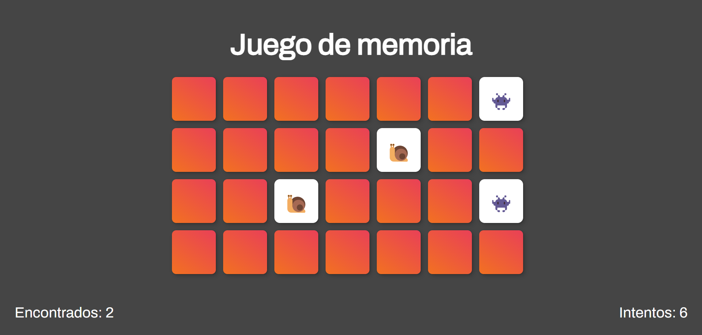
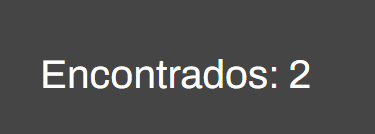
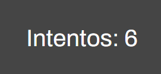

# Juego de Memoria

##
Este proyecto es un juego en el cual las personas deben de buscar un par de cartas iguales para ganar.



##
Esta función baraja las cartas para ponerlas en lugares aleatorios utilizando 
``` Javascript
Math.random()
```

``` Javascript
function barajaTarjetas() {
  return totalTarjetas.sort(() => 0.5 - Math.random());
}
```

## Comparado a la imagen anterior, se puede ver que las tarjetas no se encuentran en el mismo lugar.


# Contador e intentos

##
El juego también muestra un contador de cuantos pares encontrados llevas y en cuantos intentos logras terminar el juego

# Encontrados 👌


# Intentos 🥹


## Como se gana 🤔
Al conseguir las 14 parejas el juego se da por finalizado


# Otros cambios esteticos 😎

 Decidimos cambiar el color de fondo por algo mas tranquilo para la vista utilizando un tono gris.


 Añadimos nuevos emojis

"🙈", "🙉", "🐷", "🦍","😍","🍟"
