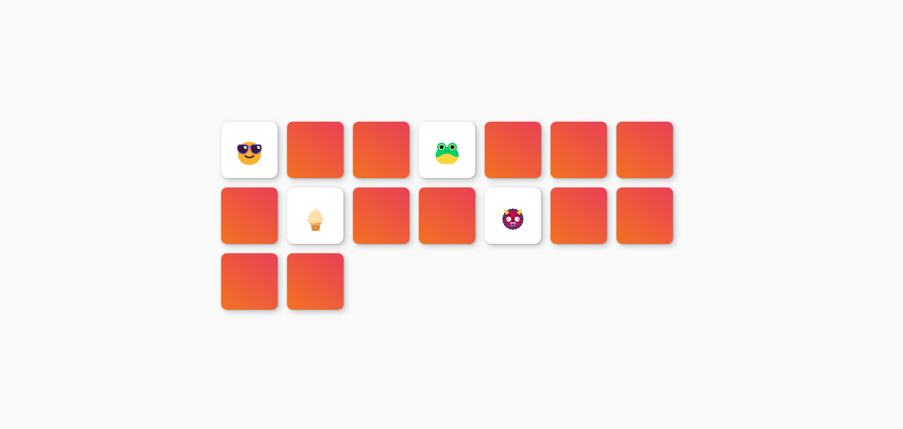

# Juego de Memoria

##
Este proyecto es un juego en el cual las personas deben de buscar un par de cartas iguales para ganar.

![Captura de pantalla] )

##
Esta función baraja las cartas para ponerlas en lugares aleatorios utilizando 
``` Javascript
Math.random()
```

``` Javascript
function barajaTarjetas() {
  return totalTarjetas.sort(() => 0.5 - Math.random());
}
```

## Comparado a la imagen anterior, se puede ver que las tarjetas no se encuentran en el mismo lugar.
![Captura de pantalla ] 

# Contador e intentos
![Captura de pantalla] 
##
El juego también muestra un contador de cuantos pares encontrados llevas y en cuantos intentos logras terminar el juego

## Encontrados
![Captura de pantalla] 

## Intentos
![Captura de pantalla] 
