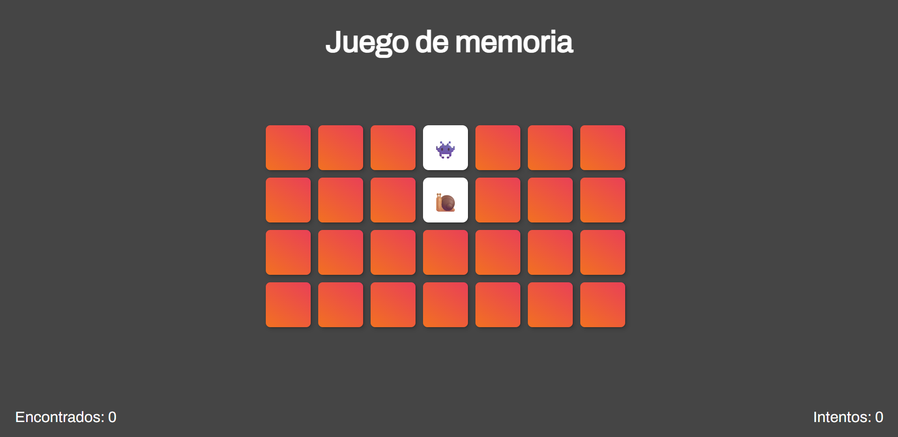

# Juego de Memoria

##
Este proyecto es un juego en el cual las personas deben de buscar un par de cartas iguales para ganar.

![Captura de pantalla] 

##
Esta función baraja las cartas para ponerlas en lugares aleatorios utilizando 
``` Javascript
Math.random()
```

``` Javascript
function barajaTarjetas() {
  var resultado;
  resultado = totalTarjetas.sort(function() {
    return 0.5 - Math.random();
  });
  return resultado;
}
```

## Comparado a la imagen anterior, se puede ver que las tarjetas no se encuentran en el mismo lugar.
![Captura de pantalla ] 


## Decidimos cambiar el color del fondo por algo mas tranquilo y menos cansador para la vista y ademas guiandonos por la estetica agregamos 5 emojis nuevos "🙈", "🙉", "🐷", "🦍","😍","🍟"


!![Captura de pantalla ] 

