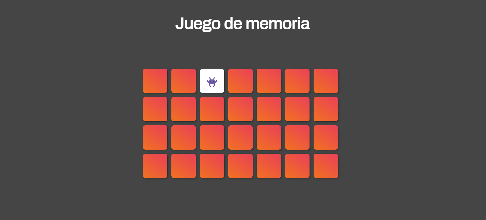

# Juego de Memoria

##
Este proyecto es un juego en el cual las personas deben de buscar un par de cartas iguales para ganar.

![Captura de pantalla] 

##
Esta función baraja las cartas para ponerlas en lugares aleatorios utilizando 
``` Javascript
Math.random()
```

``` Javascript
function barajaTarjetas() {
  var resultado;
  resultado = totalTarjetas.sort(function() {
    return 0.5 - Math.random();
  });
  return resultado;
}
```

## Comparado a la imagen anterior, se puede ver que las tarjetas no se encuentran en el mismo lugar.
![Captura de pantalla ] 


## Decidimos realizar unas mejoras esteticas 
Nuevos emojis agregados al juego: "🙈", "🙉", "🐷", "🦍","😍","🍟".

Color de fondo: Se cambió a un tono gris oscuro (#454545) utilizando una variable CSS (--bg).
 


![Captura de pantalla ] 

## Se agrego un contador de aciertos

Se implemento un contador de aciertos para que los participantes puedan ir viendo su progreso dentro del juego.

![Captura de pantalla ] 
